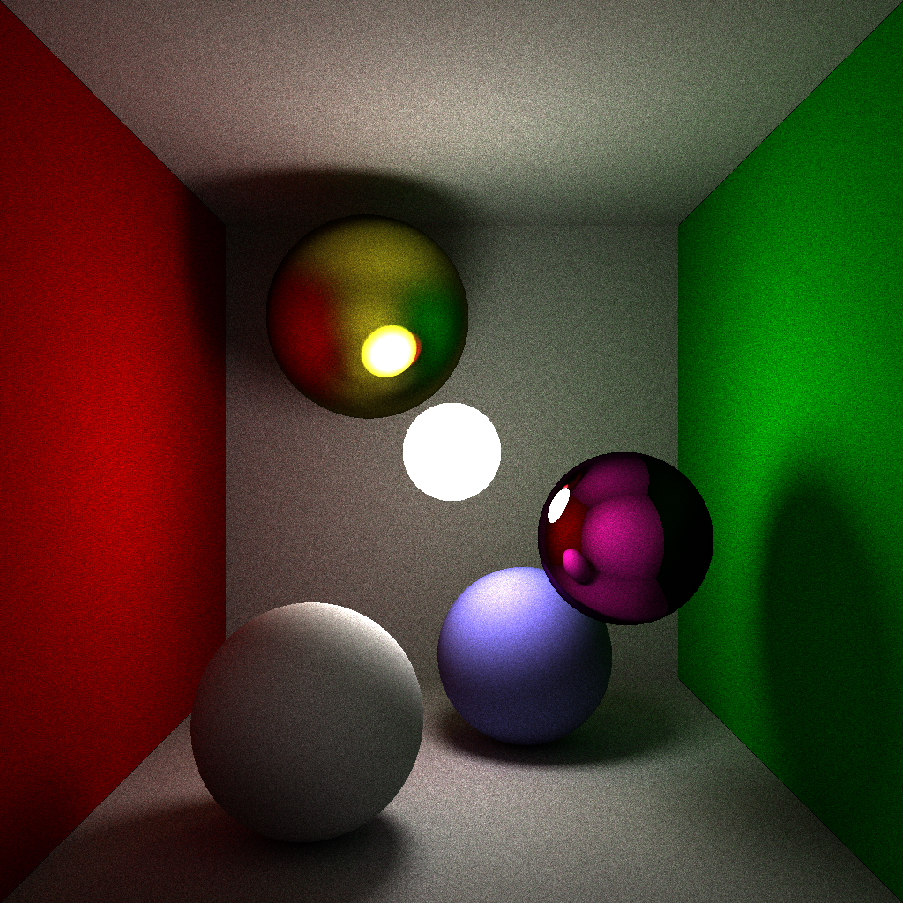

# CardRay

### main.cpp

    #include <cstdio>                     // ./main | Out-File out.ppm -Encoding ASCII
    #include <cmath>
    #define O operator
    #define R return
    using F=float;using I=int; struct V {F x,y,z;V(F n){x=y=z=n;}V(F a,F b,F c){x=a;y=
    b;z=c;};V O-(V a){ R{x-a.x,y-a.y,z-a.z}; }V O*(V a){ R{x*a.x,y*a.y,z*a.z}; }F O/(V
    a){ R x*a.x+y*a.y+z*a.z; }F O!(){R sqrt(x*x+y*y+z*z);} }; F E(F&i,F&j,V a){F d=a.y
    *a.y-4*a.x*a.z,s=sqrt(d),n=s-a.y,m=2*a.x;R d<0?i=j=0:d>0?(i=n/m,j=(-s-a.y)/m):i=j=
    n/m,d;} F S(V&p,V&n,V c,F r,V o,V d){V g=c-o; if(!g>r && (d/g<0 || !V{d.y*g.z-g.y*
    d.z,d.z*g.x-g.z*d.x,d.x*g.y-g.x*d.y}/!d>r))R 1e7;g=g*-1;F i,j;E(i,j,{d/d,2*(d/g),g
    /g-r*r});n=(p=!(d*i)<!(d*j)?o-d*-i:o-d*-j)-c;n=n*(1./!n);R !(o-p);}F G(){R sqrt(-2
    *log((rand()+1)/32768.))*cos(.0001917534*rand());} F w=1e5; struct{V p,c=1;F r=w,s
    =0;} M[]={ {{0,-80,100},1,12,0},{{0,w,0}},{{0,-160-w,0}},{{0,0,200+w}},{{0,0,30-w}
    },{{80+w,-80,0},{0,1,0}},{{-80-w,-80,0},{1,0,0}}, {{-30,-24,70},1,24},{{20,-24,130
    },{.5,.5,1},24},{{40,-60,90},{.94,.08,.7},20,1},{{-25,-120,150},{1,1,.15},30,.7} }
    ;V T(F&e,I _,V o,V d,I i){d=d*(1/!d);V p=0,n=0,b=0,m=0;F s=1e6,z;I k=-1,j=0;for(;j
    <11;j++)s=i-j && s>(z=S(b,m,M[j].p,M[j].r,o,d))?k=j,n=m,p=b,z:s;if(k<0||_<0)R e=0;
    V r{G(),G(),G()}; r=r*((r/n<0?-1.:1.)/!r);r=(d-n*(d/n)*2-r)*M[k].s-r*-1;V c=T(e,_-
    1,p,r,k)*M[k].c-(k?0:-1);e=n/r*e+(k?0:40); R c; } I C(I n){R n<0?0:n>255?255:n;} I
    main(){I w=1024,s=4096,t=16,y=0,x,i; printf("P3 %d %d 255 ",w,w); for(;y<w;y++)for
    (x=0;x<w;x++){V c=0;for(i=0;i<s;i++){F e;V m=T(e,t,{0,-80,-120},{(F)x/w-.5f,(F)y/w
    -.5f,1},4);c=c-(m*e)*-1;}c=c*(255./s); printf("%d %d %d ",C(c.x),C(c.y),C(c.z));}}

### out.ppm (已转换为 out.png | Converted to out.png)

### 一些其它事情 | Something else

这段程序的渲染可能会耗费十个小时左右的时间，但可以将倒数第三行的 w、s、t 三个变量分别改成 400、512、4，便能在几分钟后就得到一张图片（虽然质量会有点差）

The rendering of this program may take about ten hours, but you can change the variables w, s, t in the third to last row to 400, 512, 4, respectively, to get an image in a few minutes (although the quality may be a bit poor)
